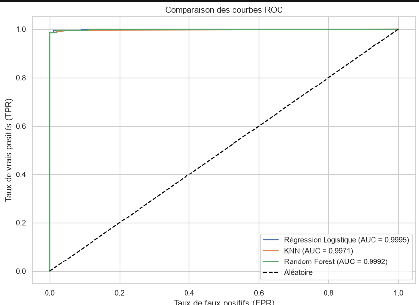
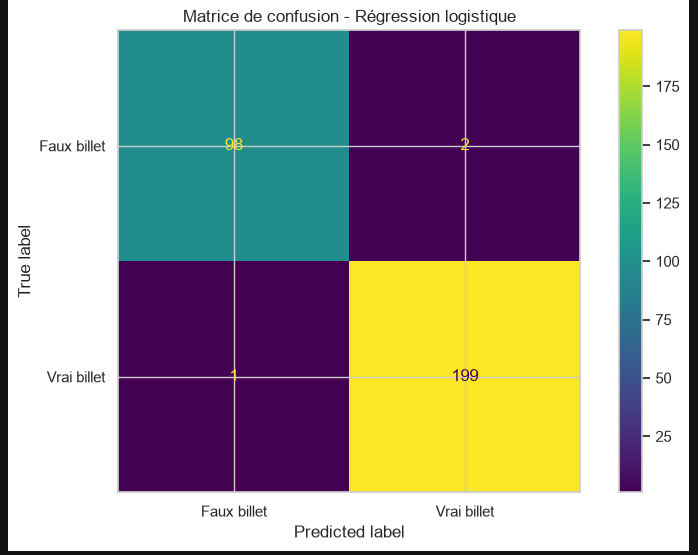
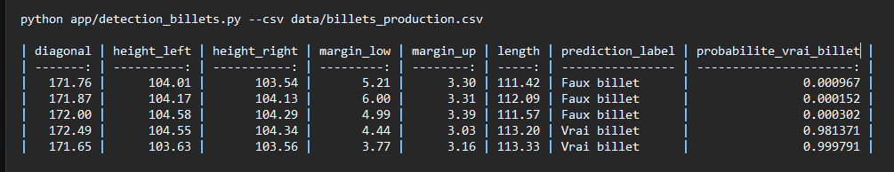

# Projet ONCFM — Détection de faux billets par Machine Learning

## Contexte

Ce projet a été réalisé dans le cadre d’un cas métier simulant un besoin de l’ONCFM.

L’objectif consiste à automatiser la détection de faux billets à partir de mesures géométriques afin d’assister le contrôle qualité et réduire les risques de fraude.

---

## Captures du projet
Les visualisations ci-dessous illustrent les performances du modèle final ainsi que son intégration dans un outil de prédiction exploitable en production.

### Courbe ROC
Comparaison des performances des modèles de classification.



---

### Matrice de confusion
Évaluation détaillée du modèle final (régression logistique).



---

### Prédiction en ligne de commande
Exemple d'utilisation du script CLI sur des billets de production.



## Objectif métier

Le système doit permettre de :

- détecter rapidement un billet suspect ;
- réduire les erreurs humaines ;
- améliorer la fiabilité du contrôle ;
- fournir une probabilité de validité du billet.

---

## Dataset

Le jeu de données contient :

- 1500 billets ;
- 1000 vrais billets ;
- 500 faux billets.

Variables utilisées :

- diagonal
- height_left
- height_right
- margin_low
- margin_up
- length

Variable cible :

- is_genuine

---

## Technologies utilisées

- Python
- Pandas
- NumPy
- Scikit-learn
- Matplotlib
- Joblib

---

## Analyse exploratoire (EDA)

L’analyse des données a permis d’identifier plusieurs variables fortement discriminantes entre vrais et faux billets.

Variables les plus importantes :

- length
- margin_low
- margin_up
- height_left
- height_right

La variable **diagonal** présente un pouvoir de séparation plus faible.

Un traitement des valeurs manquantes a également été réalisé sur la variable :

- margin_low (37 valeurs manquantes)

Les données ont ensuite été :

- nettoyées ;
- séparées en train / test ;
- standardisées.

---

## Modèles testés

Plusieurs modèles de Machine Learning ont été comparés :

- Régression Logistique
- K-Nearest Neighbors (KNN)
- Random Forest
- K-Means (clustering)

L’objectif était de comparer précision, robustesse et capacité de généralisation.

---

## Résultats des modèles

| Modèle | Accuracy | F1 Score |
|--------|----------|----------|
| Logistic Regression | 99.00% | 99.25% |
| Random Forest | 98.67% | 99.01% |
| KNN | 98.33% | 98.75% |
| KMeans | 98.67% | 99.00% |

---

## Modèle retenu

Le modèle final retenu est la **Régression Logistique**.

Pourquoi ce choix :

- meilleure accuracy globale ;
- excellente interprétabilité ;
- très bonne généralisation ;
- modèle léger et rapide en production.

Performance finale :

- Accuracy : 99.00 %
- ROC AUC : 0.99945

---

## Exemple de prédiction

Exemple de prédiction sur un billet :

- diagonal = 172.49
- height_left = 104.55
- height_right = 104.34
- margin_low = 4.44
- margin_up = 3.03
- length = 113.20

Résultat :

- Classe prédite : Vrai billet
- Probabilité : 98.14 %

Le système retourne à la fois une classe prédite et un score de confiance.

---

## Livrable technique

Le projet comprend :

- notebook d’analyse exploratoire ;
- entraînement des modèles ;
- sauvegarde du modèle final (.pkl) ;
- application CLI de prédiction ;
- export CSV des prédictions.

Exemple d’utilisation :

```bash
python app/detection_billets.py --csv data/billets_production.csv
```

---

## Valeur ajoutée

Ce projet démontre mes compétences en :

- préparation de données ;
- analyse exploratoire ;
- Machine Learning supervisé ;
- évaluation de modèles ;
- industrialisation d’un pipeline prédictif.

---

## Conclusion

Ce projet illustre ma capacité à transformer un besoin métier en solution Data Science opérationnelle.

Il combine :

- compréhension métier ;
- rigueur analytique ;
- modélisation statistique ;
- déploiement technique.
