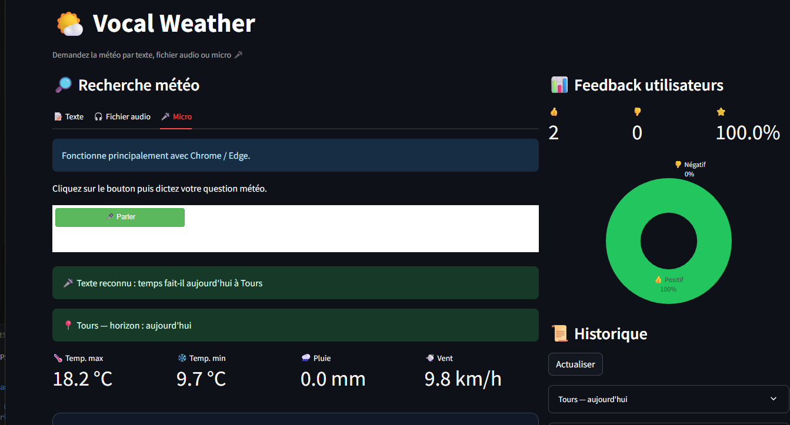
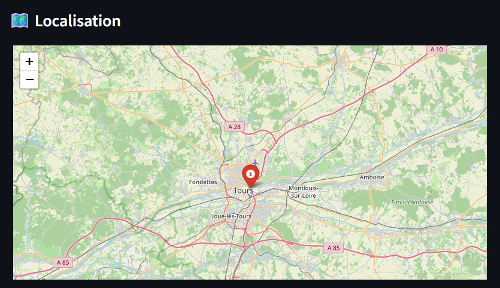
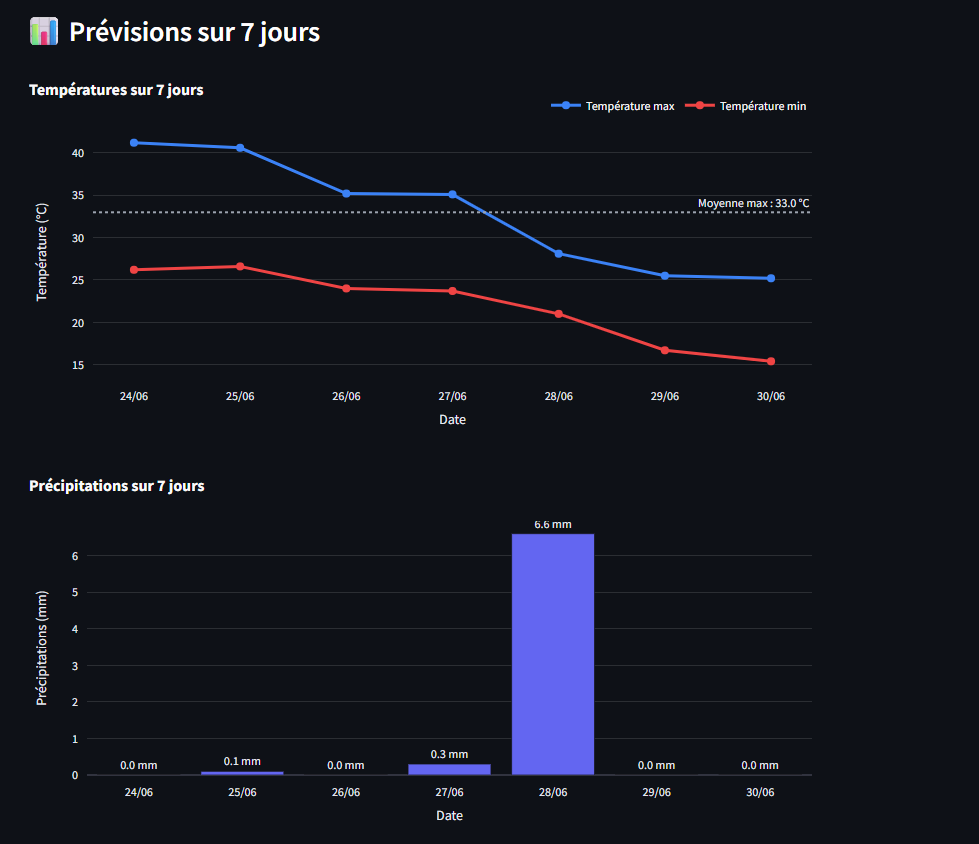

# Projet Vocal Weather — Assistant météo vocal intelligent

## Contexte

Vocal Weather est une application Full Stack permettant d’obtenir des prévisions météo via une interaction vocale ou textuelle.

Le projet simule un assistant conversationnel capable de comprendre une demande utilisateur, interroger une API météo puis restituer les résultats sous forme visuelle et vocale.

---
## Captures du projet

Les captures ci-dessous illustrent l’interface Streamlit ainsi que les principales fonctionnalités de l’application Vocal Weather.

### Interface principale
Vue générale de l’application avec saisie texte, audio et affichage des résultats météo.

---

### Carte météo géolocalisée
Visualisation cartographique de la ville détectée par l’application.

---

### Prévisions sur 7 jours
Affichage graphique des températures et précipitations prévues.

## Objectif métier

L’application doit permettre de :

- comprendre une requête météo utilisateur ;
- identifier la ville demandée ;
- récupérer les données météo via API ;
- afficher une visualisation claire ;
- répondre vocalement à l’utilisateur.

---

## Fonctionnalités principales

L’application propose :

- recherche météo par texte ;
- recherche météo par audio ;
- reconnaissance vocale (STT) ;
- synthèse vocale (TTS) ;
- historique des requêtes ;
- collecte de feedback utilisateur ;
- visualisation météo sur 7 jours.

---

## Architecture technique

Le projet est structuré en deux parties :

### Backend

- FastAPI
- SQLite
- API Open-Meteo
- Pydantic
- SlowAPI

### Frontend

- Streamlit
- Folium
- Plotly

---

## Technologies utilisées

- Python
- FastAPI
- Streamlit
- SQLite
- Plotly
- Folium
- Pytest

---

## API Backend

Le backend expose plusieurs endpoints REST :

- POST /api/v1/meteo
- POST /api/v1/feedback
- GET /api/v1/feedback/stats
- GET /api/v1/historique
- GET /api/v1/health

Le backend assure :

- validation des entrées ;
- traitement des requêtes météo ;
- persistance des données ;
- gestion des erreurs.

---

## Base de données

Les requêtes utilisateurs sont stockées dans SQLite.

Exemples de données enregistrées :

- texte brut ;
- ville détectée ;
- latitude / longitude ;
- température minimale ;
- température maximale ;
- description météo ;
- service STT utilisé ;
- statut de requête.

---

## Qualité logicielle

Le projet a été testé avec Pytest.

Couverture des tests :

- API : 25 tests
- NLU : 14 tests
- STT : 3 tests

Le système inclut également :

- validation Pydantic ;
- rate limiting via SlowAPI ;
- gestion des exceptions.

---

## Valeur ajoutée

Ce projet démontre mes compétences en :

- développement backend ;
- conception d’API REST ;
- intégration de services externes ;
- visualisation de données ;
- conception d’application orientée utilisateur.

---

## Conclusion

Vocal Weather illustre ma capacité à développer une application Data & IA de bout en bout.

Le projet combine :

- intelligence artificielle ;
- développement logiciel ;
- data visualisation ;
- expérience utilisateur.
